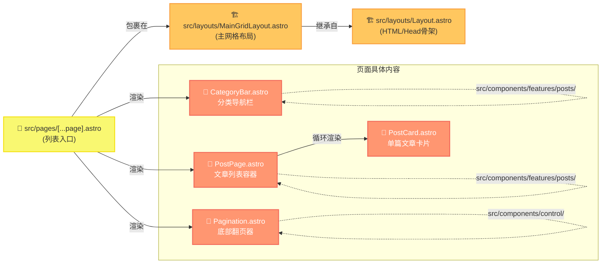
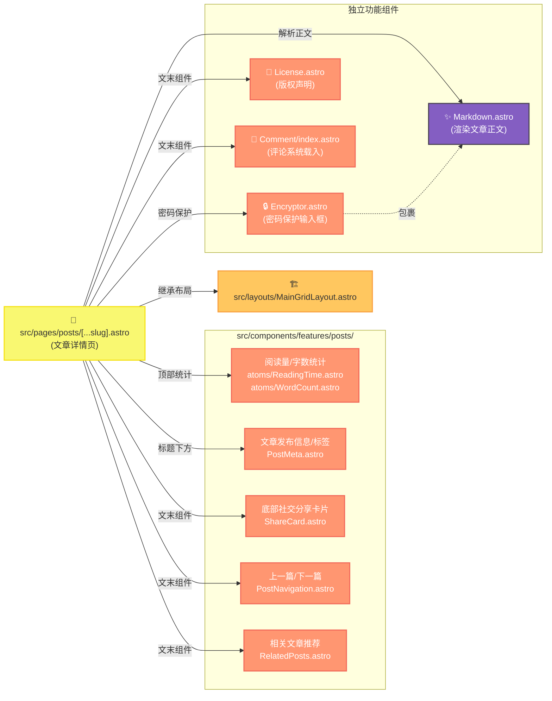
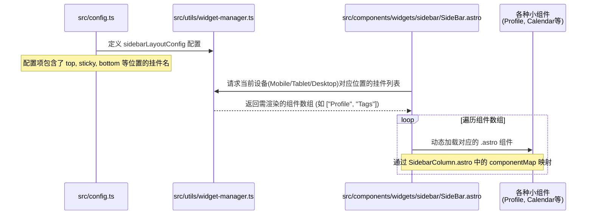
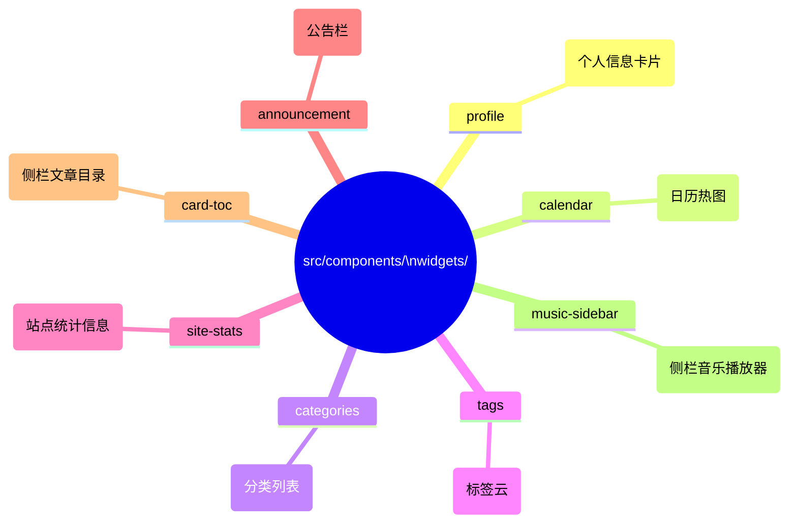

# Mizuki 页面级组件依赖与架构图解

本文档深入到具体页面级别，详细展示了**首页/列表页**、**文章详情页**的组件树构成，以及特殊的**动态侧边栏组件注入机制**。通过这些图表，你可以精确知道某个页面的具体功能是由哪个路径下的哪个组件负责的。

---

## 1. 🏠 首页/文章列表页组件树 (`src/pages/[...page].astro`)

首页本质上是一个带分页的文章列表页。它的组件嵌套关系如下：

**💡 修改建议：**
* **修改文章列表的卡片样式：** 定位到 `src/components/features/posts/PostCard.astro`
* **修改翻页按钮：** 定位到 `src/components/control/Pagination.astro`

---

## 2. 📝 文章详情页组件树 (`src/pages/posts/[...slug].astro`)

文章详情页是博客最复杂的部分，包含了内容渲染、元信息、评论、分享等众多功能模块。

**💡 修改建议：**
* **修改 Markdown 渲染的 HTML 标签样式：** 定位到 `src/components/misc/Markdown.astro` 以及 `src/styles/main.css` 里的 `.markdown-content`
* **更换或修改评论系统：** 定位到 `src/components/comment/` 目录下（如 `Twikoo.astro`, `Giscus.astro`）
* **修改文章底部的分享卡片：** 定位到 `src/components/features/posts/ShareCard.astro`

---

## 3. 🧩 侧边栏与小组件动态注入机制

Mizuki 的侧边栏并不是写死在代码里的，而是通过 `widgetManager` 读取 `src/config.ts` 中的配置动态渲染的。这就是为什么你直接搜 `Profile.astro` 找不到它在哪里被直接 import 的原因。

### 侧边栏组件物理位置地图

所有的挂件都统一放置在 `src/components/widgets/` 目录下，每个挂件独立成一个文件夹：

**💡 修改建议：**
* **想要调整侧边栏挂件的顺序或显示/隐藏：** **不要改代码**，去改项目根目录下的 `src/config.ts` 文件中的 `sidebarLayoutConfig` 对象。
* **想要修改个人卡片 (Profile) 的样式：** 去 `src/components/widgets/profile/Profile.astro`。
* **如果新增了一个自定义侧栏挂件：** 必须在 `src/components/layout/SidebarColumn.astro` 里的 `componentMap` 中注册它，否则配置文件里写了也无法渲染！(详见 `docs/rule/06-sidebar-widget-dev.md`)
